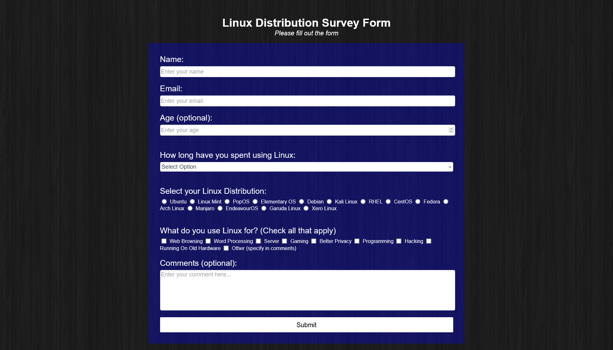
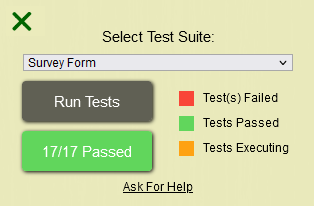

Back to [Index](../README.md)
____
# Day 20: May 13, 2022
#### Today's Progress:
- Spent 2 hours working on the CSS part of the Survey Form and completed it. 

- My Survey Form passed [freeCodeCamp](https://www.freecodecamp.org/learn/responsive-web-design/)'s code grader script 

#### Thoughts:
Now that I finished my survey form web page, I don't think it's as good as the one from freeCodeCamp's example survey form, But I think its good enough for now.

###### Link(s) to work:
[My  Survey Form](https://dragoscript.github.io/SurveyForm/) 
[My  Survey Form Source Files](https://github.com/DragoScript/SurveyForm)
___
