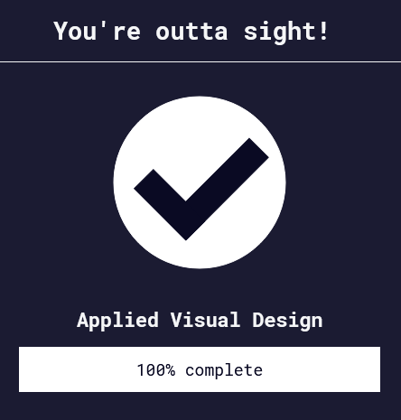
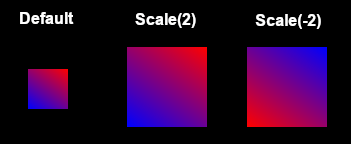

Back to [Index](../README.md)
____
# Day 10: May 3, 2022
#### Today's Progress:
- Spent 2 hours progress through [freeCodeCamp](https://www.freecodecamp.org/learn/responsive-web-design/)'s responsive web design course and completed part 3,  applied visual design.

#### Thoughts:
In the  responsive web design course, I learned about another method of setting colours in CSS. This method is called `hsl()` which stands for hue saturation and lightness. `hsl()` makes it easy to adjust a colour's tone. Next, I learned about `transform: scale();`. `scale()` is used to change an object's size. If a negative number is used, the `scale()` will flip the object. 

The transform function has other features besides `scale()`.  For example,  `move()`, `rotate()`, and `skewX()`/`skewY()`. In addition, I learned about `::before` and `::after` pseudo-element. The `::before` pseudo-element creates a child that is first of a selected element. Whereas, the `::after` pseudo-element creates a child that is last of a selected element. Finally, I did some animation exercises using  `@keyframes` and completed applied visual design aka part 3 of the course.

###### Link(s) to work:

___
