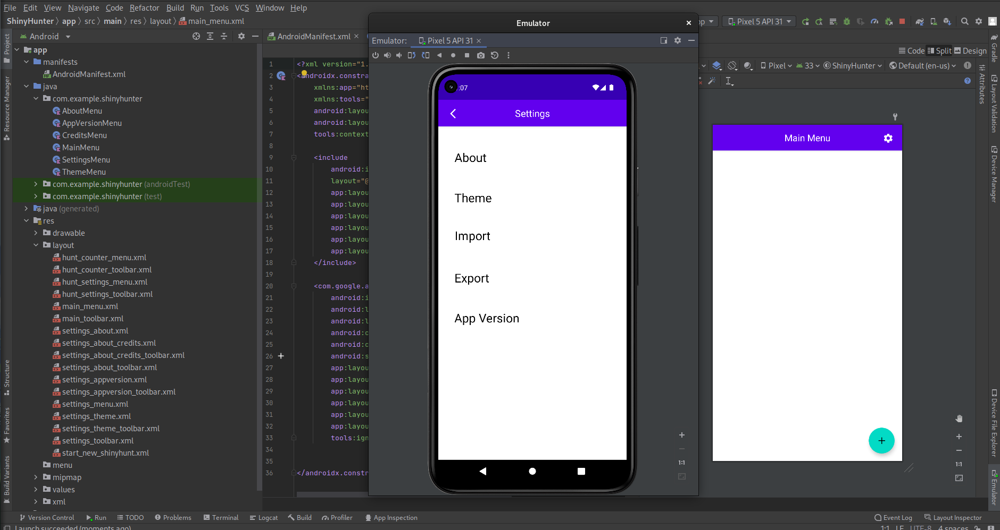

[<--](../Days/Day99.md) | [Index](../README.md)
____
# Day 100: August 1, 2022
#### Today's Progress:
- Spent 4 hours working on ShinyHunter app backend

#### Thoughts:
I wasn't able to complete my android app in time, but at least I didn't miss a single day in the 100 days of code challenge. I'm still going to finish the app after the challenge. For next summer I'm probably going to 1 or 2 projects per summer, that way I'm not pressured into code every single day even on busy days. 

###### Link(s) to work:
[ ShinyHunter GitHub](https://github.com/DragoScript/ShinyHunter )
___
