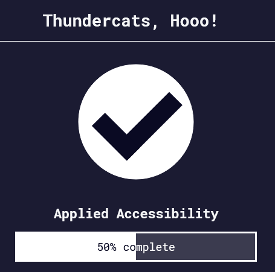

Back to [Index](../README.md)
____
# Day 11: May 4, 2022
#### Today's Progress:
- Started part 4 of  the responsive web design course by [freeCodeCamp](https://www.freecodecamp.org/learn/responsive-web-design/) called applied accessibility, and spent 1 hour progressing through the course

#### Thoughts:
I learned about `<article>` tag. This is one of the new standalone content elements introduced by HTML5. Instead of using the  `
` tag for wrapping content like blog post, forum posts, or news articles. The `<article>` tag is a much better option, as  it helps organizes your web page. Furthermore, the `<section>` tag is another new element introduced by HTML5. The `<section>` tag is used for grouping related content. In addition, the `<figure>` and `<figcaption>` tag are also new elements introduced by HTML5. The `<figure>` tag is used for wrapping content like, diagrams, charts, or images for better organization like the article tag. The `<figcaption>` tag is used to provide caption to note the trends or conclusions of the content. The `<figcaption>` tag works in conjunction with the `<figure>` tag.

###### Link(s) to work:

___
