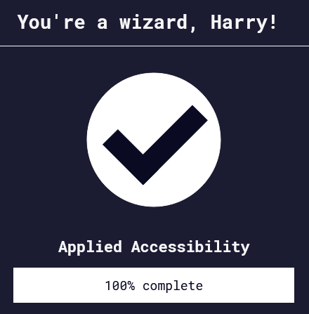

Back to [Index](../README.md)
____
# Day 12: May 5, 2022
#### Today's Progress:
- Spent 1 hour progressing through the responsive web design course by [freeCodeCamp](https://www.freecodecamp.org/learn/responsive-web-design/) and completed part 3, applied accessibility. 

#### Thoughts:
In the responsive web design course, I did some colour contrast, `accesskey` and `tableindex` exercises. I already know about most of these features so this was just review for me.

###### Link(s) to work:

___
