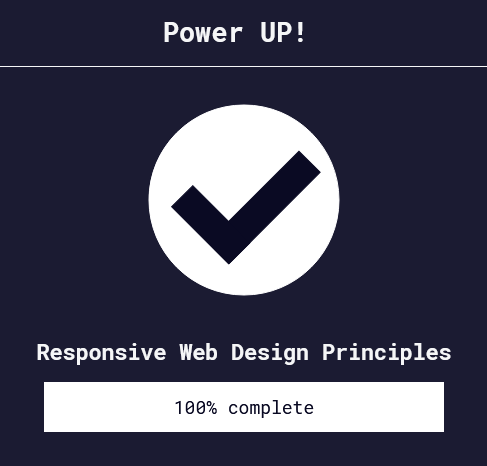

Back to [Index](../README.md)
____
# Day 12: May 6, 2022
#### Today's Progress:
-  Started part 5 of the responsive web design course by [freeCodeCamp](https://www.freecodecamp.org/learn/responsive-web-design/) called responsive web design principles, and spent 30 minutes to complete it. 

#### Thoughts:
In the responsive web design course, I learned about the `@media` tag, as well as the `max-height`, `min-height`, `max-width`, and `min-width`. These can be used to make images/content responsive.

###### Link(s) to work:

___
