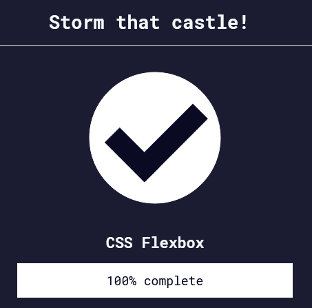

Back to [Index](../README.md)
____
# Day 14: May 7, 2022
#### Today's Progress:
-  Started part 6 of the responsive web design course by [freeCodeCamp](https://www.freecodecamp.org/learn/responsive-web-design/) called CSS flexbox, and spent 1 hour and completed it.

#### Thoughts:
In the responsive web design course, I did flex-direction, justify-content, align-items, flex-wrap, flex-shrink, flex-grow, flex-basis, order, and align-self exercises. 

###### Link(s) to work:

___
