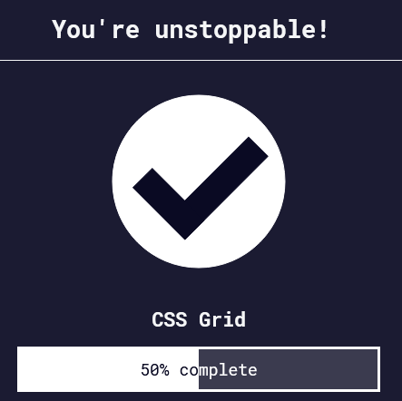

Back to [Index](../README.md)
____
# Day 15: May 8, 2022
#### Today's Progress:
- Started part 7 (the final part) of the responsive web design course by [freeCodeCamp](https://www.freecodecamp.org/learn/responsive-web-design/) called CSS grid, and spent 1 hour progressing through the course. 

#### Thoughts:
In the responsive web design course, I learned about `display: grid;` and the grid structure `grid-template-columns`, `grid-template-rows`, `grid-column-gap`, `grid-row-gap`, and `grid-gap`. The number of parameters given to `grid-template-columns` will determine the number of columns in the grid, and the value of each number in the parameter determine its width. The `grid-template-rows` manually adjust the number of rows, the `grid-column-gap` adds a gap between columns, and `grid-row-gap` adds a gap between rows. In addition,  if `grid-gap` has 2 parameters the first parameter will adjust the gap between the rows and the second parameter will adjust the gap between the columns. However if `grid-gap` has only 1 parameter it will adjust both rows and columns.

###### Link(s) to work:

___
