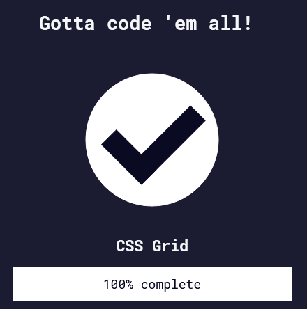

Back to [Index](../README.md)
____
# Day 16: May 9, 2022
#### Today's Progress:
- Spent 1 hour progress through [freeCodeCamp](https://www.freecodecamp.org/learn/responsive-web-design/)'s responsive web design course and completed part 7 (the final part), CSS grid. 

#### Thoughts:
In the responsive web design course, I learned about `grid-template-areas`, `repeat()`, and  `minmax()`. The`grid-template-areas` groups cells of grid into four areas, the `repeat()` function to specify the number of times you want your column or row to be repeated, and the `minmax()` function is used to limit the size of content when grid container changes.

###### Link(s) to work:

___
