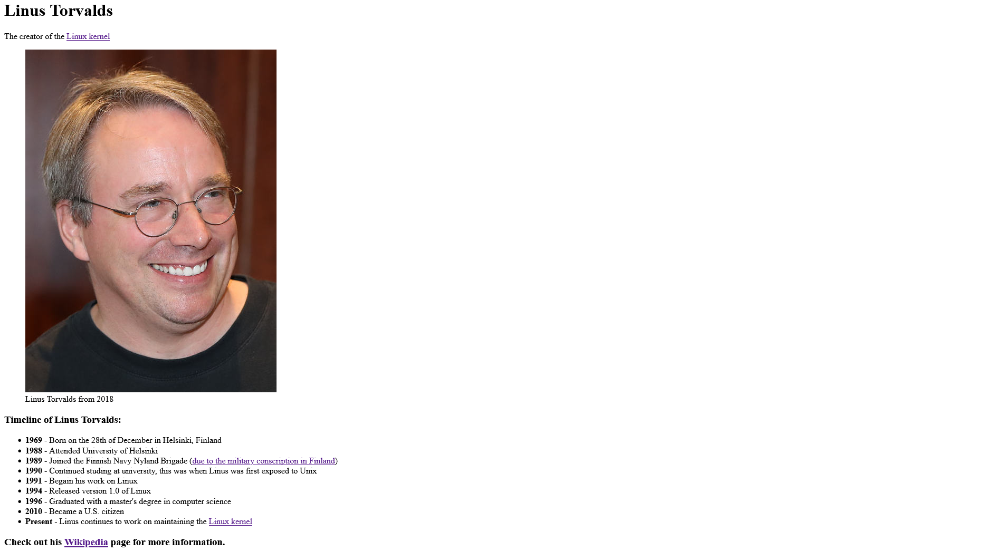

Back to [Index](../README.md)
____
# Day 17: May 10, 2022
#### Today's Progress:
- Started Working on the first project called, Tribute Page by [freeCodeCamp](https://www.freecodecamp.org/learn/responsive-web-design/)'s responsive web design course. 
-  Spent 1 hour and 30 minutes working on the HTML part of the Tribute Page and finished it.

#### Thoughts:
Since I've managed to complete the HTML part of the Tribute Page I will start working on the CSS part the next day, and hopefully complete it.

###### Link(s) to work:

___
