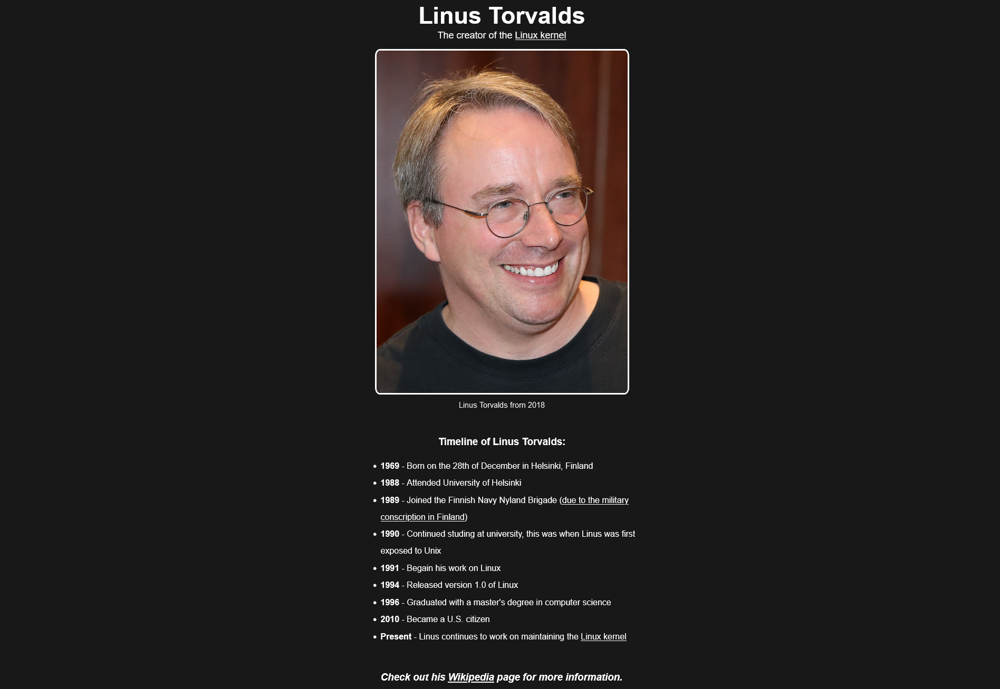
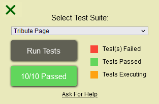

Back to [Index](../README.md)
____
# Day 18: May 11, 2022
#### Today's Progress:
-  Spent 2 hours working on the CSS part of the Tribute Page and completed it.

-  My Tribute Page passed [freeCodeCamp](https://www.freecodecamp.org/learn/responsive-web-design/)'s code grader script 

#### Thoughts:
My biggest challenge when doing the CSS was trying to center the tribute-info part and make the image responsive. I was able to solve both of these issues by looking at how freeCodeCamp's tribute page web page solved them and try and apply it to my web page.

###### Link(s) to work:
[My Tribute Page](https://dragoscript.github.io/TributePage/) 
[My Tribute Page Source Files](https://github.com/DragoScript/TributePage)
___
