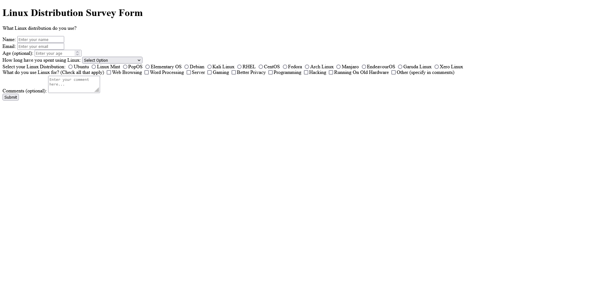

Back to [Index](../README.md)
____
# Day 19: May 12, 2022
#### Today's Progress:
- Started Working on the second project called, Survey Form by [freeCodeCamp](https://www.freecodecamp.org/learn/responsive-web-design/)'s responsive web design course. 
-  Spent 2 hours working on the HTML part of the  Survey Form and finished it. 

#### Thoughts:
Since I've finished HTML part of the project, now all that's left is the CSS which is the most difficult part in my opinion.

###### Link(s) to work:

___
