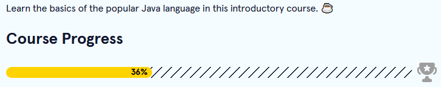

Back to [Index](../README.md)
____
# Day 2: April 25, 2022
#### Today's Progress:
- Watched a [YouTube tutorial](https://www.youtube.com/watch?v=iE8tZ0hn2Ws) on making a login screen with java using the [swing API](https://www.javatpoint.com/java-swing)

- Progressed a little further on the  "Learn Java" course by [Codecademy](https://www.codecademy.com/learn/learn-java)

#### Thoughts:
For my first project, I'm going to create a calculator application using Java. But, before I do that, I practices more Java GUI applications next. As well as, plan out the requirements and functions of a calculator.

###### Link(s) to work:
[LoginGUI.java](../Attachments-DOC/LoginGUI.java)

___
