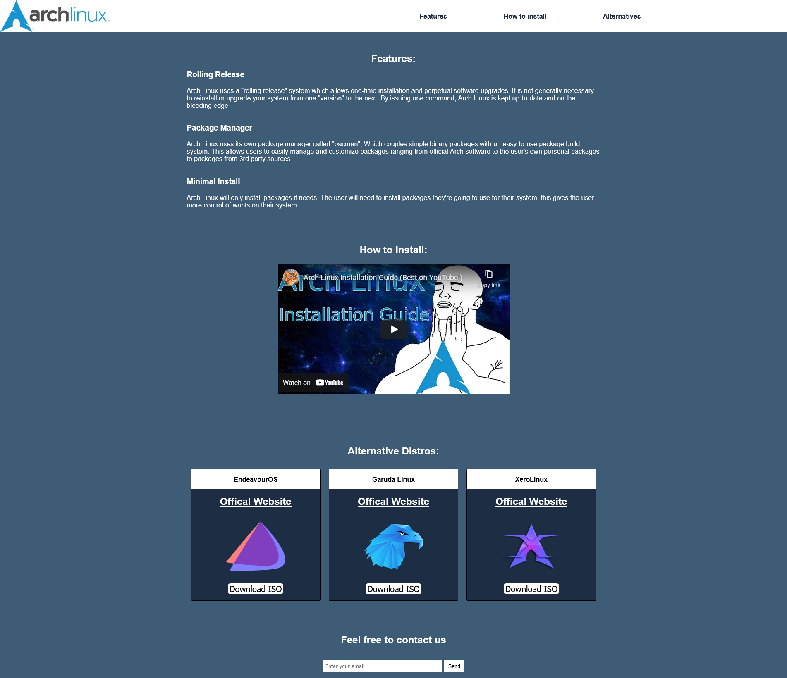
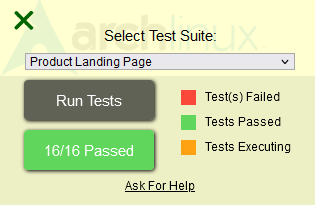

Back to [Index](../README.md)
____
# Day 22: May 15, 2022
#### Today's Progress:
- Spent 3 hours working on the CSS part of the Product Landing Page and completed it. 

- My Survey Form passed [freeCodeCamp](https://www.freecodecamp.org/learn/responsive-web-design/)'s code grader script 

#### Thoughts:
It took me a while to do the CSS part of the project and I had to rely on the CSS from freeCodeCamp's example product landing page to be able to complete mine. Man, these web developers on YouTube make it look easy, I wonder how long it took them to master it?

###### Link(s) to work:
[My  Product Landing Page](https://dragoscript.github.io/ProductLandingPage/) 
[My  Product Landing Page Source Files](https://github.com/DragoScript/ProductLandingPage)
___
