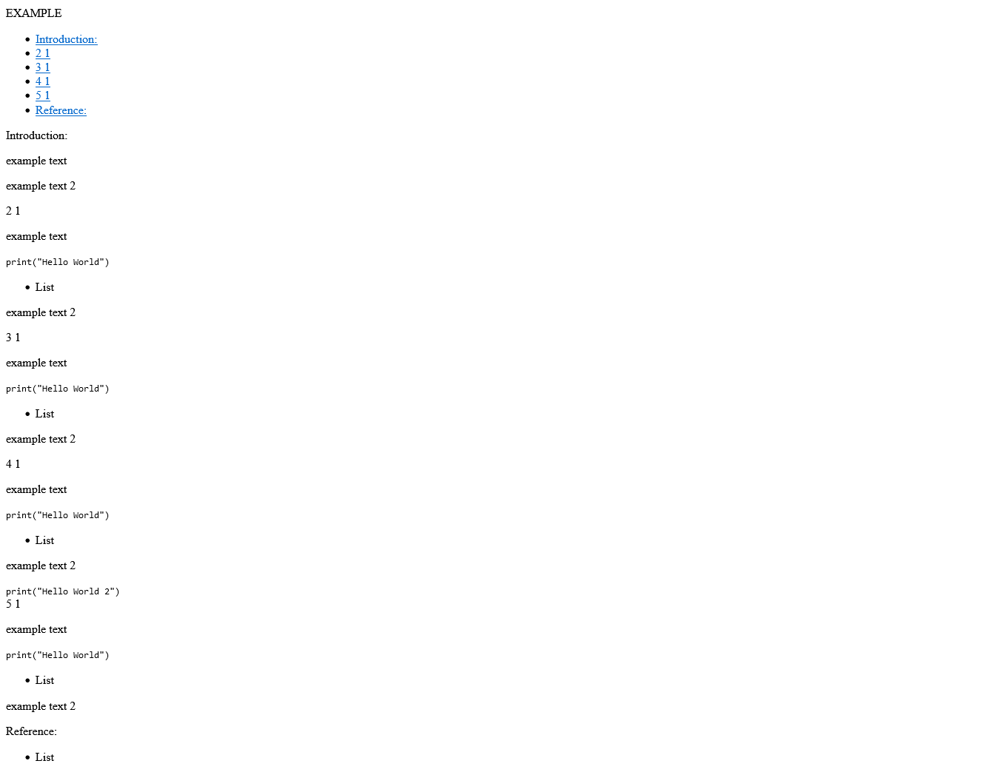

[<--](../Days/Day23.md) | [Index](../README.md) | [-->](../Days/Day25.md)
____
# Day 24: May 17, 2022
#### Today's Progress:
- Started Working on the third project called, Technical Documentation Page by [freeCodeCamp](https://www.freecodecamp.org/learn/responsive-web-design/)'s responsive web design course.
- Spent 2 hours working on the HTML part of the Technical Documentation Page and finished it. 

#### Thoughts:
Took me awhile to complete the HTML part because of a user error. I thought 10th requirement of freeCodeCamp's script was bugged, but it turns out I had a duplicate `<li><a class="nav-link" href="#3_1">3 1</a></li>`. After I complete the CSS requirements I'm going to replace my placeholder HTML.

###### Link(s) to work:

___
