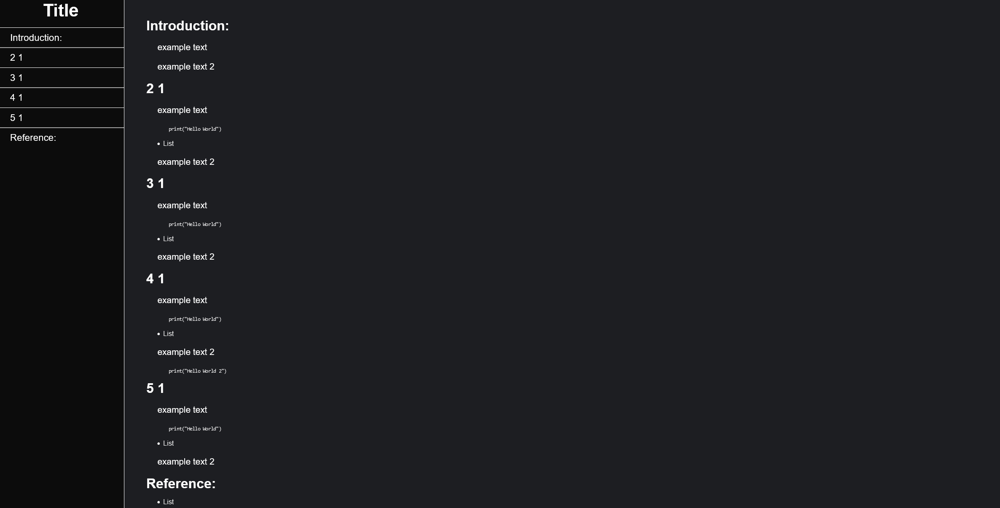
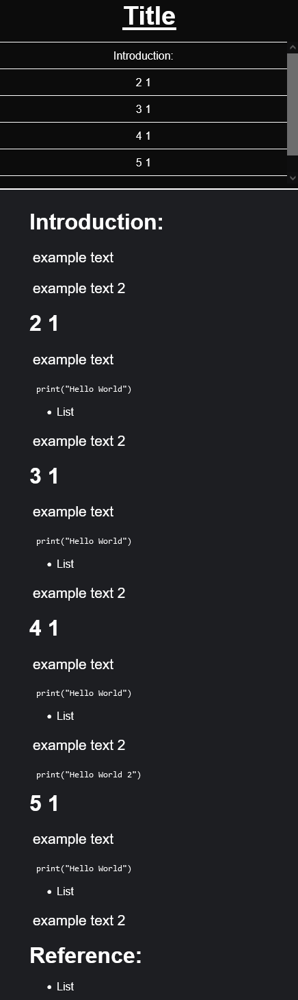

[<--](../Days/Day24.md) | [Index](../README.md) | [-->](../Days/Day26.md)
____
# Day 26: May 18, 2022
#### Today's Progress:
- Spent 1 hours working on the CSS part of the Technical Documentation Page.
 

#### Thoughts:
I used freeCodeCamp example Technical Document Page's design and modified it a bit to fit my taste, I might change the navbar's design for mobile later on.  Now i need to figure out what topic I'm going to choose for my technical documentation page, replace the template text and then I should be done

###### Link(s) to work:

___
