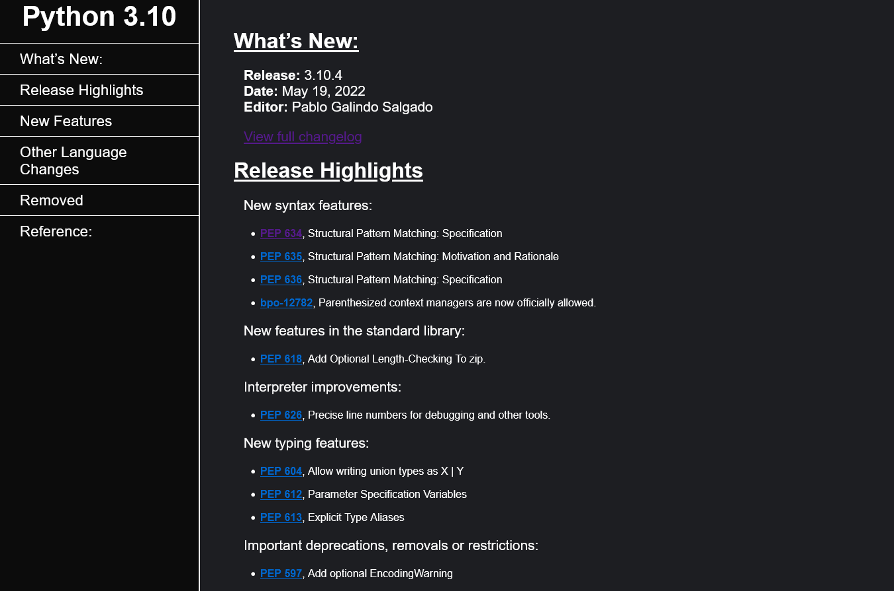
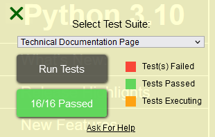

[<--](../Days/Day25.md) | [Index](../README.md) | [-->](../Days/Day27.md)
____
# Day 26: May 19, 2022
#### Today's Progress:
- Spent 2 hours working on the information part the Technical Documentation Page and completed it 

- Technical Documentation Page passed [freeCodeCamp](https://www.freecodecamp.org/learn/responsive-web-design/)'s code grader script. It will not pass when the bookmark tab is on the top, that is a bug on the script's part. 

#### Thoughts:
I have chosen Python to be my topic for the project, It took me awhile to copy the information from the Python doc and added it to my project web page and I had to cut a lot of it out. Nevertheless, this project took me a while to make, I'm going to take 2 day break from freeCodeCamp's Portfolio Project.

###### Link(s) to work:
[My Technical Documentation Page](https://dragoscript.github.io/TechnicalDocumentationPage/) 
[My Technical Documentation Page Source FIles](https://github.com/DragoScript/TechnicalDocumentationPage)
___
