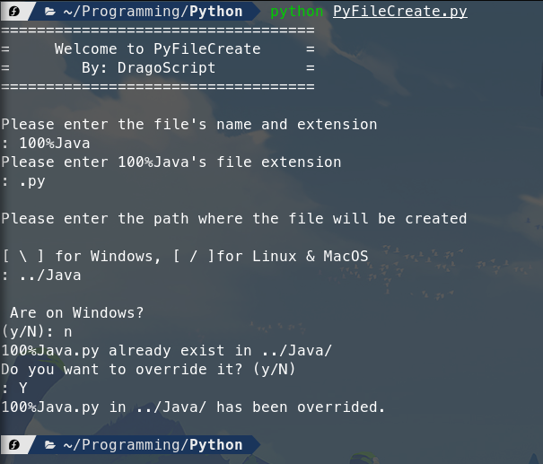

[<--](../Days/Day26.md) | [Index](../README.md) | [-->](../Days/Day28.md)
____
# Day 27: May 20, 2022
#### Today's Progress:
- I spent 1 hour and 30 minutes making a python script called "PyFileCreate". 

#### Thoughts:
I made this python script that saves time when creating a file for a specific path.
Overall, It was pretty cool to make a python script that can create files and send them to a specific path.

###### Link(s) to work:
[PyFileCreate.py](../Attachments-DOC/PyFileCreate.py)
___
