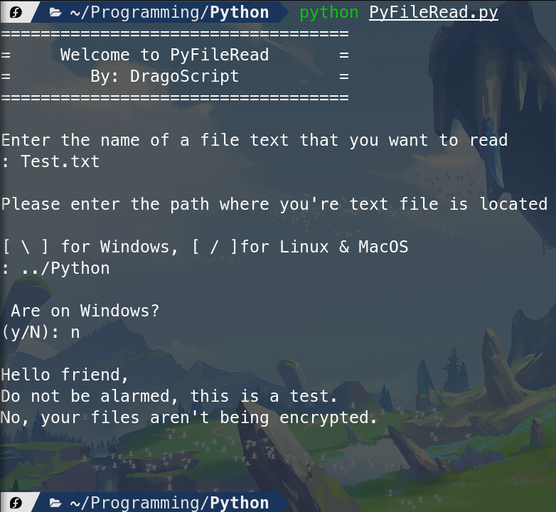

[<--](../Days/Day28.md) | [Index](../README.md) | [-->](../Days/Day30.md)
____
# Day 29: May 22, 2022
#### Today's Progress:
- I spent 1 hour making my final Python script called "PyFileRead" which does as its name implies

#### Thoughts:
I used what I learned from "PyFileCreate" to make PyFileRead. This is going to be the last Python script. I'm going to finish the portfolio web page project by freeCodeCamp

###### Link(s) to work:
[PyFileRead.py](../Attachments-DOC/PyFileRead.py)
___
