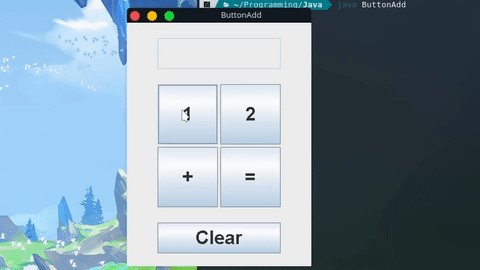

Back to [Index](../README.md)
____
# Day 3: April 26, 2022
#### Today's Progress:
- Tried to create a GUI application using [JavaFX](https://openjfx.io/index.html) which is more modern than swing. Problem is, it is no longer included with the standard install of Java. I tried to install it, but it was too much work so I gave up on it.

- By following this [YouTube video](https://www.youtube.com/watch?v=dfhmTyRTCSQ), I created a GUI application using the Java [swing API](https://www.javatpoint.com/java-swing), that adds the sum of 2 numbers. I've also learned how to changed the default font to make the application more readable.

#### Thoughts:
I was planning to use JavaFX to build the GUI for the calculator app. But since I'm having difficulties trying to install it, I'm going to stick with swing. The calculator app is going to look outdated but if it works it works.

###### Link(s) to work:
[ButtonAdd.java](../Attachments-DOC/ButtonAdd.java)
___
