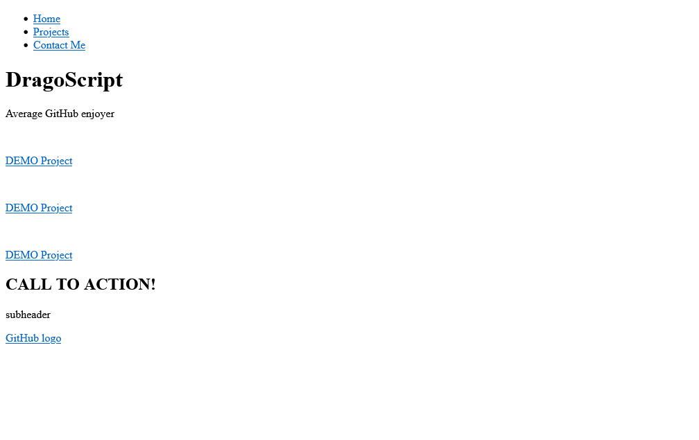

[<--](../Days/Day29.md) | [Index](../README.md) | [-->](../Days/Day31.md)
____
# Day 30: May 23, 2022
#### Today's Progress:
- Started Working on the forth and final project called, Portfolio Webpage by [freeCodeCamp](https://www.freecodecamp.org/learn/responsive-web-design/)'s responsive web design course.
- Spent 1 hour working on the HTML part of the  Portfolio Webpage and finished it. 

#### Thoughts:
I finished the HTML part of the final project, I should be able to complete this project in 2 to 3 days.

###### Link(s) to work:

___
