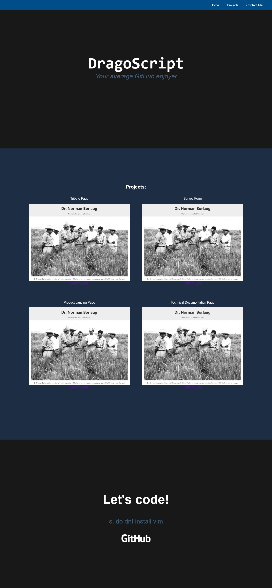

[<--](../Days/Day30.md) | [Index](../README.md) | [-->](../Days/Day32.md)
____
# Day 31: May 24, 2022
#### Today's Progress:
- Spent 2 hours working on the CSS part of the portfolio webpage project by [freeCodeCamp](https://www.freecodecamp.org/learn/responsive-web-design/)'s responsive web design course 

#### Thoughts:
I'm close to completing the CSS part of the project. The image's in the project are placeholder image from freeCodeCamp's tribute page.

###### Link(s) to work:

___
