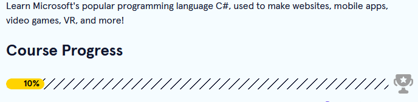

[<--](../Days/Day32.md) | [Index](../README.md) | [-->](../Days/Day34.md)
____
# Day 33: May 26, 2022
#### Today's Progress:
-  Started doing C# exercises on [Codecademy](https://www.codecademy.com/learn/learn-c-sharp) 

#### Thoughts:
Since I've finished the responsive web design course from freeCodeCamp, I was planning on doing the odin project but I decided I wouldn't do it for the 100 days of code challenge as I want to go at it on my own pace. Plus, I wanted to do some C# exercises, then make an application using winforms. 

###### Link(s) to work:

___
