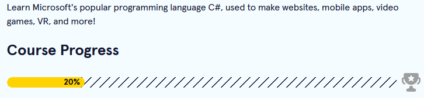

[<--](../Days/Day34.md) | [Index](../README.md) | [-->](../Days/Day35.md)
____
# Day 35: May 28, 2022
#### Today's Progress:
- I spent 30 minutes doing the Learn C# course by [Codecademy](https://www.codecademy.com/learn/learn-c-sharp) 

#### Thoughts:
I learned that if I do `" \"` in C#, I can do quotation in a string. Not gonna lie, kinda getting burned out from the 100 Days Of Code Challenge. That's why I'm doing very little, it's to prevent myself from being burned out completely.

###### Link(s) to work:

___
