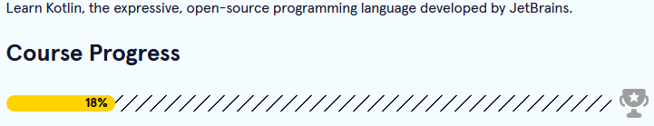

[<--](../Days/Day52.md) | [Index](../README.md) | [-->](../Days/Day54.md)
____
# Day 53: June 15, 2022
#### Today's Progress:
-  I started doing Kotlin exercises on [Codecademy](https://www.codecademy.com/catalog/language/kotlin) for 1 hour. 

#### Thoughts:
I decided to break from winform for a few days, and move on to trying to create an Android app. The language I'm going to use is Kotlin, so I will be doing Kotlin exercises on Codecademy.

###### Link(s) to work:

___
