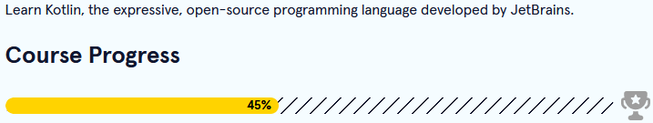

[<--](../Days/Day55.md) | [Index](../README.md) | [-->](../Days/Day57.md)
____
# Day 56: June 18, 2022
#### Today's Progress:
- I spent 30 minutes doing the Learn Kotlin course by [Codecademy](https://www.codecademy.com/learn/learn-kotlin) 

#### Thoughts:
I did some conditional expression exercises.

###### Link(s) to work:

___
