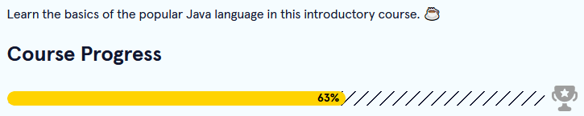

Back to [Index](../README.md)
____
# Day 6: April 29, 2022
#### Today's Progress:
- I spent 1 hour progressing thorough [Codecademy](https://www.codecademy.com/learn/learn-java)'s Learn Java course

- I started freeCodeCamp's [responsive web design](https://www.freecodecamp.org/learn/responsive-web-design/) course
- Spent 1 hour progressing thorough the course and completed the first part, Basic HTML & HTML5

#### Thoughts:
Though I already know the basics of HTML, I still learned some stuff I that I missed. For instance, the **id** attribute is important if I want to create internal links. As for the Java course, I did Arrays and ArrayLists exercises. As well as while loops and for loops exercises.

###### Link(s) to work:

___
