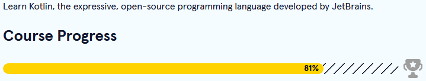

[<--](../Days/Day60.md) | [Index](../README.md) | [-->](../Days/Day62.md)
____
# Day 61: June 23, 2022
#### Today's Progress:
- I spent 30 minutes doing the Learn Kotlin course by [Codecademy](https://www.codecademy.com/learn/learn-kotlin) 

#### Thoughts:
I did some loop exercises, I will continue work on the WinCalc application the next day.

###### Link(s) to work:

___
