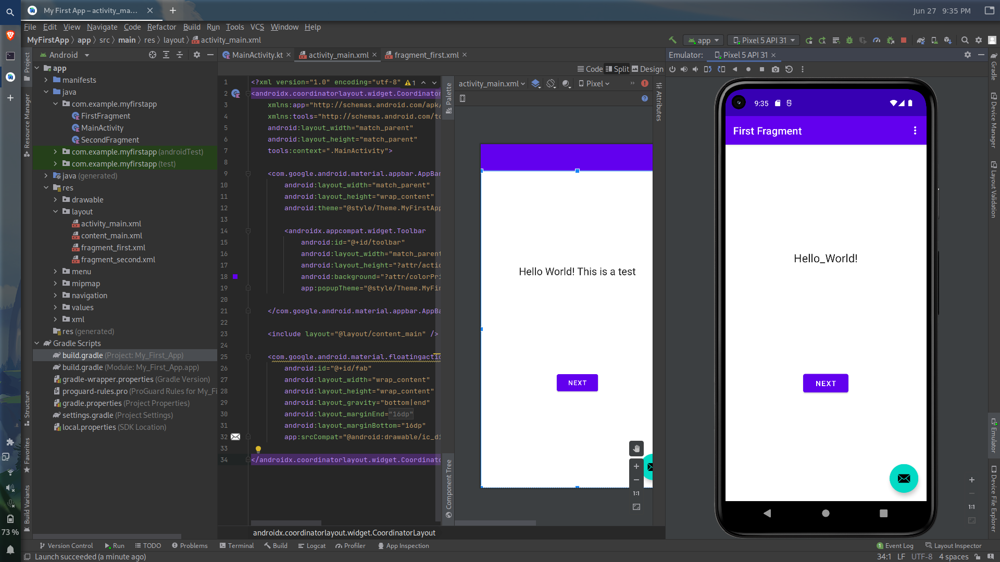

[<--](../Days/Day64.md) | [Index](../README.md) | [-->](../Days/Day66.md)
____
# Day 65: June 27, 2022
#### Today's Progress:
-  First time setting up Android Studio on Fedora Linux
-  I read the Android Developer Documentation: [App Basics](https://developer.android.com/guide) section (Introduction part to Build Your First App part)
-  Created a test app to get the hang of Android Studio

#### Thoughts:
Before I can start to make Android apps, I need to spend time learning how to use Android Studio and all of its features as well as reading the documentation or watching YouTube tutorial videos.

###### Link(s) to work:

___
