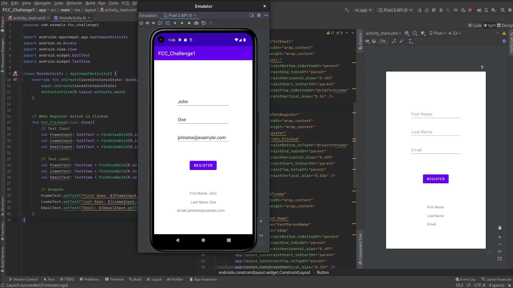

[<--](../Days/Day65.md) | [Index](../README.md) | [-->](../Days/Day67.md)
____
# Day 66: June 28, 2022
#### Today's Progress:
- Started watching a YouTube video by freeCodeCamp called [Android Development for Beginners](https://youtu.be/fis26HvvDII) and stopped at 1:07:19
- Completed the first Android app challenge from the YouTube video

- I read the Android Developer Documentation: [App Basics](https://developer.android.com/guide) section (App fundamentals part)

#### Thoughts:
The first major issue I have with the Android Development for Beginners video is that they're using Java instead of Kotlin. But overall The first hour of the video taught me about some of Android Studio's Key features like, TODO, Build, Logcat and Profiler. I managed to complete the first challenge from the freeCodeCamp YouTube video using Kotlin instead of Java.

###### Link(s) to work:

___
