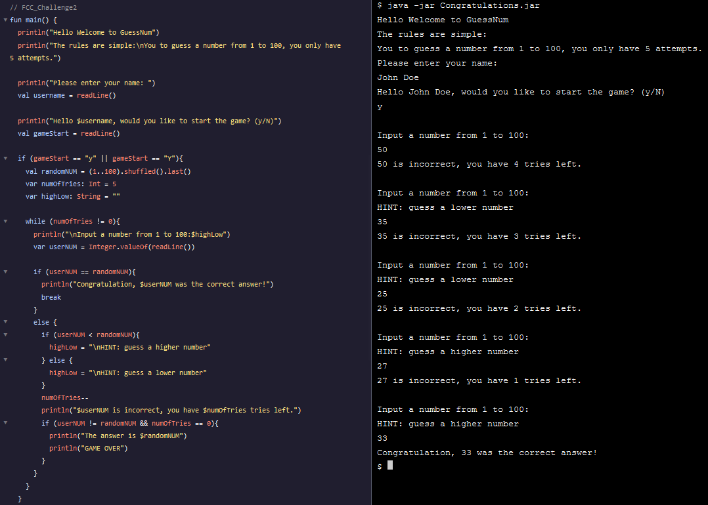

[<--](../Days/Day66.md) | [Index](../README.md) | [-->](../Days/Day68.md)
____
# Day 67: June 29, 2022
#### Today's Progress:
- continued watching the YouTube video by freeCodeCamp called [Android Development for Beginners](https://youtu.be/fis26HvvDII) at 1:07:19 and stopped at 2:16:00
- Completed the second  challenge from the YouTube video 
 
- I read the Android Developer Documentation: [App Basics](https://developer.android.com/guide) section (App resources/Overview part to App resources/Handle configuration changes part)

#### Thoughts:
The second hour of the video is dedicated to Java and the challenge is a terminal game, I managed to code the game in Kotlin instead of Java.

###### Link(s) to work:

___
