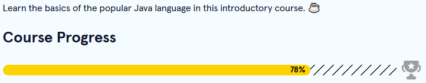
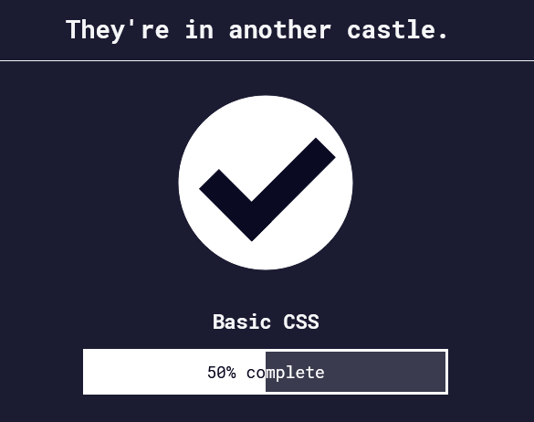

Back to [Index](../README.md)
____
# Day 7: April 30, 2022
#### Today's Progress:
- I spent 1 hour progressing thorough [Codecademy](https://www.codecademy.com/learn/learn-java)'s Learn Java course

- spent another hour progressing thorough [freeCodeCamp](https://www.freecodecamp.org/learn/responsive-web-design/)'s responsive web design course
 

#### Thoughts:
In the Learn Java course I learned how  **public** and **private** keyword works. The **private** keyword means it only allows the class where it was declared to access it, while  **public**  allows itself to be accessed from any class. For the responsive web design course, I already know most of the basics of CSS, but I've learned a few things. I learned that you can have 2 class names in one `class=""` line. For example,  `class="class1 class2"`. 
In addition, I learned that the **id** keyword is more important than the **class** keyword. For example, both **id** and **class** make changes the text's colour of an element. This would cause a conflict. However, because **id** is more important than **class**,  **id**'s text colour will replace **class**'s colour, while **class**'s colour cannot replace **id**'s colour.

###### Link(s) to work:

___
