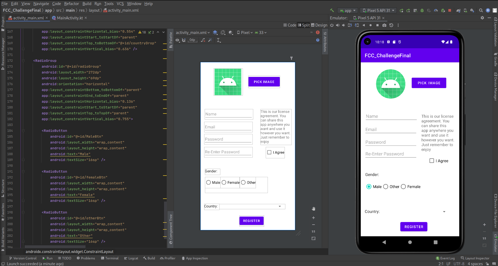

[<--](../Days/Day77.md) | [Index](../README.md) | [-->](../Days/Day79.md)
____
# Day 78: July 10, 2022
#### Today's Progress:
- Spent 35 minutes doing the final challenge from the YouTube video and completed part 1 of the challenge 
 
- Continued watching the YouTube video by freeCodeCamp called [Android Development for Beginners](https://youtu.be/fis26HvvDII) at 10:40:36 and 10:57:18

#### Thoughts:
It took me a while to fix the layout, I also added a radioGroup to my radio buttons which I forgot to do yesterday. Now that I completed part 1 of the challenge (the user interface), part 2 is going to be the backend part of the app.

###### Link(s) to work:

___
