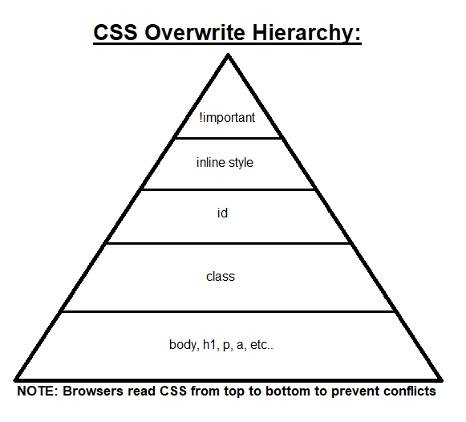

Back to [Index](../README.md)
____
# Day 8: May 1, 2022
#### Today's Progress:
- I spent 1 hour doing the Learn Java course by [Codecademy](https://www.codecademy.com/learn/learn-java) and completed the course

- Spent another hour doing the responsive web design course by [freeCodeCamp](https://www.freecodecamp.org/learn/responsive-web-design/) and completed the second part, Basic CSS.
 

#### Thoughts:
In the Learn Java course, I did the final three topics; inheritance, debugging, and  2D Arrays (which gave me the most trouble) and finished the course. For the responsive web design course, I learned that I can create a custom CSS variable, for example, `--cool-color: green;` and give that variable to the background keyword, which will make the background green. Additionally, I learned about the overwrite hierarchy in CSS and made a triangle diagram of it:  

###### Link(s) to work:

___
