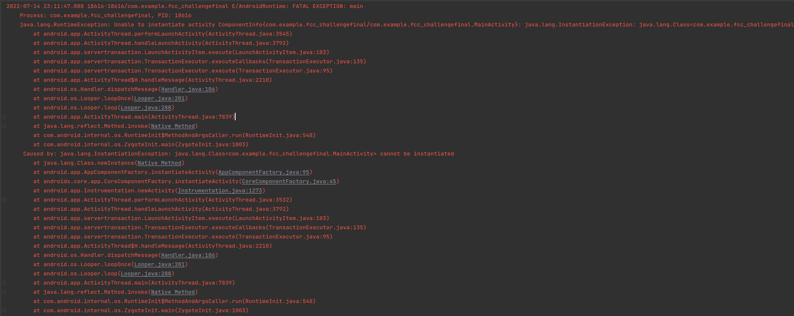

[<--](../Days/Day81.md) | [Index](../README.md) | [-->](../Days/Day83.md)
____
# Day 82: July 14, 2022
#### Today's Progress:
- Spent 40 minutes doing the final challenge from the YouTube video called [Android Development for Beginners](https://youtu.be/fis26HvvDII) by freeCodeCamp
- Stuck due to an "Fatal Exception" error I'm unable to solve (code can be found in "Link(s) to work:") 

#### Thoughts:
Unfortunately, I wasn't able to get the final challenge to run due to an annoying error I encountered and I think I can fix it since the error message doesn't make sense to me. 
If I can't get it fixed the next day I'm going to drop it and also the sample application to move on to my android app project that I want to get done before the 100th day.

###### Link(s) to work:
[MainActivity.kt](../Attachments-DOC/MainActivity.kt)
___
