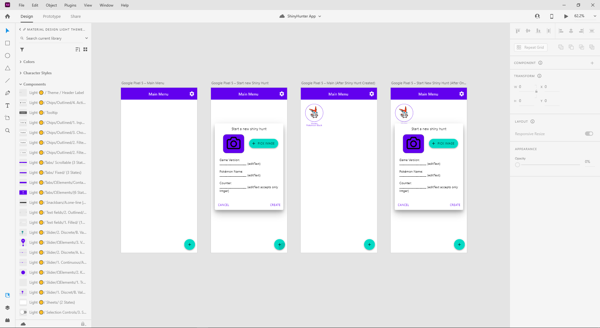

[<--](../Days/Day85.md) | [Index](../README.md) | [-->](../Days/Day87.md)
____
# Day 86: July 18, 2022
#### Today's Progress:
- Spent 1 hour designing a prototype ShinyHunter app on Adobe XD

#### Thoughts:
I know my UI looks basic, but for my first app it gets the job done. Also, I'm think I should've used [Figma](https://www.figma.com/) instead of [Adobe XD](https://www.adobe.com/products/xd.html). Because there are a few things missing, like the editText label (I had to improvise) from the Android Material Design Kit, and Figma is a webapp so I don't have to install any software on my desktop.

###### Link(s) to work:

___
