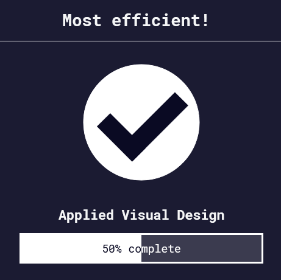

Back to [Index](../README.md)
____
# Day 9: May 2, 2022
#### Today's Progress:
- I started the third part of the responsive web design course by [freeCodeCamp](https://www.freecodecamp.org/learn/responsive-web-design/) called applied visual design.

- I spent 2 hour progressing thorough the course
 

#### Thoughts:
In the  responsive web design course, I learned that the major difference between `rgb()` and `rgba()` is that,  `rgba()` allows you to adjust its opacity while `rgb()` doesn't. Next, I learned about transforming text (`text-transform`). There a 6 values that transform text, `lowercase`, `uppercase`, `capitalize`, `initial`, `inherit`, and `none`. Lastly, I learned about the  `z-index` and how it can be used for layering or overlapping content/objects in CSS. The `z-index` uses integers (it will ignore decimals) for ordering.
 

###### Link(s) to work:
___
